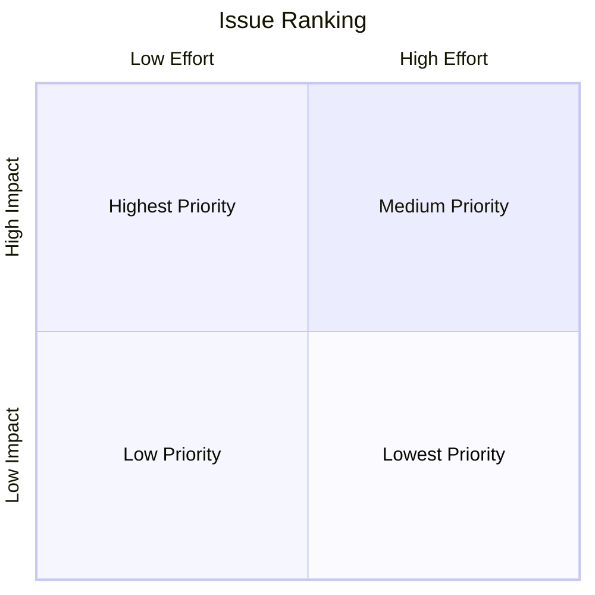

# Impact-Effort Analysis for Prioritizing Issues

<!--toc:start-->

- [Impact-Effort Analysis for Prioritizing Issues](#impact-effort-analysis-for-prioritizing-issues)
  - [Overview](#overview)
  - [Methodology](#methodology)
    - [Process](#process)
    - [Matrix](#matrix)
    - [Effort](#effort)
    - [Impact](#impact)
  - [Scripts](#scripts)
    - [Prerequisites](#prerequisites)
    - [Usage](#usage)
  - [Addendum](#addendum)
    - [Strictness](#strictness)
    <!--toc:end-->

The goal of using Impact-Effort Analysis (IEA) is to provide a minimal effort prioritization methodology for determining which bodies of work (namely Github issues in this context) to work on first. The method is far from scientific and rigorous but I've found it useful enough and have shared it enough times that it warrants writing down in one place that I can link out to.

## Overview

The main goal of IEA is to prioritize work in the most economical way. Work that requires low effort but delivers large value is more desirable than work that takes high effort but delivers little to no value. That's basically it. Find a way to sort work so that you complete low-effort, high-impact tasks first and then move down the list.

I've also included some basic scripts below to set help set up a Github repo to perform this analysis on.

## Methodology

Below is a general guideline to the methodology. Feel free to tweak, update, or adapt as you see fit.

### Process

1. Collect all known development tasks. Generally, this is just looking at a repo's issues page but if you're managing multiple repositories or if you do not use issues then whatever software or non-software you want to use is fine. A whiteboard and some stickies are underrated.
2. For each task, estimate [effort](#effort) and [impact](#impact). Time box this so you don't spend too much time on one issue. You can alway come back.
3. Once each task has an estimation, add them to the [matrix](#matrix) to sort prioritization. This can just be a mental model or in a list. You don't have to use a real matrix.
4. Start with the tasks that are low-effort and high-impact and start to work on those.
5. Update your assumptions about the work. Maybe it's actually higher effort than you though. See if you can break down the work into subtasks that are also prioritized.
6. Once you've either completed that/those task(s) or have selected other tasks to work on and completed those, reevaluate your assumptions for the other tasks. Maybe this work changed some of the effort it will take for the others or maybe this nullified some of the value some other task will bring.
7. Re-estimate tasks, add new tasks, and remove ones you known you'll never get to. This process is circular but not necessarily in order.

### Matrix

A two-dimensional matrix is used to visualize priorities. The Y-axis is [impact](#impact) and the X-axis is [effort](#effort). Ranking is from left-to-right, and top-to-bottom.



### Effort

Effort is a subjective estimation for the amount of development work required to complete some feature, fix some bug, or some other task. You can have a binary choice of low or high, use T-shirt sizing, or whatever methodology you want to just get an estimation on the board. This isn't final. You can always come back and update your estimate of effort. My personal suggestion is to stick with the easiest thing and just say high or low. Additionally, you should be able to see some high effort estimates as indicative that the task should be broken down into smaller, lower effort tasks.

### Impact

Impact is a subjective estimation for the amount of value completing a task provides. This could be business value, technical value, or anything else. There is more than just one type of value for development work so you should use your head. Always pushing out tech debt for feature work because of "immediate business value" is short sighted. What about development velocity value? Or mental health value? Again, personal preference here is to do the simplest thing and just give an answer or high or low.

## Scripts

These scripts edit a target repository and add pre-made labels to them so you can label issues with effort and impact estimations.

### Prerequisites

These scripts assume you have [`gh`](https://cli.github.com) CLI installed and are authenicated with write access to the target repo.

### Usage

Ensure that the scripts are executable:

```sh
find scripts -type f -name "*.sh" -exec chmod +x {} \; -print
```

Run the scripts (use `-h` or `--help` for usage):

```sh
scripts/add_labels.sh --repo owner/repo --quiet
```

## Addendum

### Strictness

This is not some business school, McKinsey, or PMI prescription of how to do project management the "right way". This is mainly a tool to elucidate priorities for teams or individuals that are swamped with development tasks. Saying yes to everything and not having a clear picture of what is important and what isn't is not helpful so using something like this can benefit teams that want minimal project management overhead.
